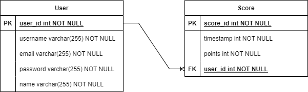

# advanced-js-geoguessr

## How to run

>1. Server: `npm start` in `/server`
>2. Client: `npm serve` in `/client`

## Database Overview
- User - A table representing the user's information
- Score - A table representing the score for each game

> The relationship between User and Score is one to many.

  

